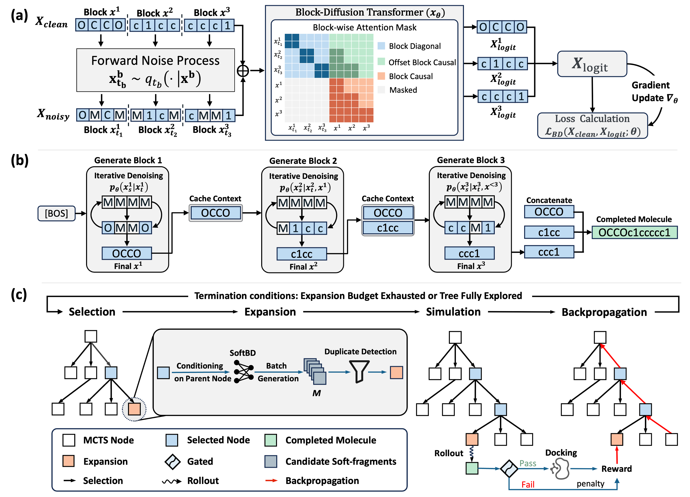

# From Tokens to Blocks: A Block-Diffusion Perspective on Molecular Generation

<div align="center">
<!--  -->
<!--  -->
</div>

This repository contains the official implementation of the paper **"From Tokens to Blocks: A Block-Diffusion Perspective on Molecular Generation"**.

## Overview
We introduce SoftMol, a unified framework for target-aware molecular generation that co-designs representation, architecture, and search strategy to address the limitations of 1D molecular language models. SoftMol introduces Soft-Fragments, a rule-free block representation that enables diffusion-native modeling, and SoftBD, a block-diffusion model combining local bidirectional diffusion with global autoregressive generation to capture refined chemical structures. Integrated with a gated MCTS for target-specific optimization and trained on the high-quality ZINC-Curated dataset, SoftMol achieves state-of-the-art performance, delivering 100% chemical validity, a 9.7% improvement in binding affinity, and a 6.6× speedup in inference efficiency.



## Installation

To set up the environment, please use the provided YAML file to create a Conda environment with all necessary dependencies.

```bash
conda env create -f environment.yml
conda activate softmol
```

## Pre-trained Weights

To reproduce the reported results, pre-trained model weights are required.
> **Note**: Due to the double-blind review process, the download link for the weights is temporarily withheld.

Once obtained, please place the weight files in the `./weights` directory.

> **Recommendation**: While we provide checkpoints for multiple model scales (55M, 74M, 89M, 116M, 624M), the results reported in the paper are primarily based on **`89M-epoch6-best.ckpt`**. We recommend using this checkpoint for standard reproduction.

## Usage

### 1. De Novo Generation
For unconstrained molecule generation, SoftMol (SoftBD) can generate chemically valid and diverse molecules efficiently.

To generate molecules:
```bash
python sample.py
```

### 2. Target-specific molecular design (SBDD)
SoftMol can be applied to generate ligands for specific protein targets using our gated Monte Carlo Tree Search (MCTS) framework.

#### Prerequisites
The docking utility requires executable permissions for the `qvina02` binary:
```bash
chmod +x gated_mcts/utils/docking/qvina02
```

#### Generation for Standard Targets
We support generation for 5 benchmark protein targets verified in our paper: `parp1`, `jak2`, `fa7`, `5ht1b`, and `braf`.

> **Protein files**: After obtaining the receptor file for a target (e.g., `parp1.pdbqt`), place it under `gated_mcts/utils/docking/` so the docking pipeline can find it.

To run the generation process:
```bash
# Example for parp1 (default)
python gated_mcts/run_mcts.py
```

### 3. Training
To train a SoftBD model from scratch on your own dataset:

1.  **Prepare Data**: Place your SMILES dataset in a directory (e.g., `data/SMILES`).
2.  **Run Training**: Use the following Hydra-configured command:
    > **Hardware Note**: We trained the 89M SoftBD model using **8 NVIDIA RTX 4090 GPUs**. You may need to adjust `loader.global_batch_size` and `loader.num_workers` based on your available hardware.

```bash
python -u main.py \
  data.tokenizer_name_or_path=vocab_V2.txt \
  model=small-89M algo=bd3lm \
  model.length=72 block_size=8 \
  loader.global_batch_size=1600 loader.eval_global_batch_size=1600 loader.num_workers=16 \
  trainer.precision=bf16-mixed \
  model.attn_backend=sdpa training.resample=True \
  trainer.val_check_interval=0.1 trainer.limit_val_batches=0.1 \
  'hydra.run.dir=${hydra:runtime.cwd}/outputs/data/SMILES/${algo.name}-${model.name}-len${model.length}-bs${block_size}/' \
  'sampling.logdir=${hydra:run.dir}/samples' \
  data.smiles_path=data/SMILES \
  trainer.max_steps=1_334_000
```

## Results & Reproducibility

We provide comprehensive experimental data to support our findings:

-   **De Novo Generation**: Results for 10,000 molecules generated by SoftBD across 3 random seeds are available in `results/denovo/softbd`. In our experiments, using a sampling configuration of **$K_{\text{sample}}=2$, $p=0.95$, $\tau=1.0$**, SoftBD achieved **100% validity** across these samples.
-   **SBDD Benchmark**: Generated molecules for 5 targets × 3 seeds (3,000 molecules each) for both SoftMol and SoftMol (Unconstrained) are provided in `results/sbdd/softmol/main` and `results/sbdd/softmol/unconstrained`.
-   **Ablation Studies**: Data from 360 ablation experiments (9 variables × 4 settings × 5 targets × 2 models) are included in `results/sbdd/softmol/ablation`.
-   **Baselines**: Reproduction results for *f*-rag, GEAM, and GenMol on SBDD tasks are also provided in `results/sbdd/baselines`.

### Evaluation Script
To evaluate the generated molecules against the SBDD metrics:
```bash
python eval_sbdd.py
```
